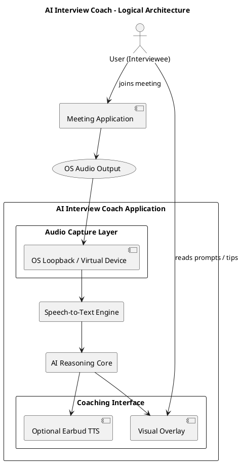

# **Product Architecture Document (PAD)**

**Project:** AI Interview Coach – Audio Monitoring Assistant

**Version:** 1.0

**Date:** 04 Nov 2025

**Author:** Stephen Edwards

**Reference ADRs:** ADR-007 – *Exclusion of Direct Integration with Meeting Applications*

---

## **1. Purpose**

This document defines the system architecture for the  **AI Interview Coach** , whose objective is to provide real-time interview assistance by analysing the interviewer’s speech and generating adaptive coaching prompts for the user.

The architecture ensures the solution remains:

* **Platform-agnostic** (no dependency on specific meeting software),
* **Legally compliant** (transparent processing and user control),
* **Cost-efficient** (no API licensing or integration overhead).

---

## **2. Scope**

The system assists the interviewee during live online meetings (e.g., Teams, Zoom, Google Meet, etc.) by:

* Capturing remote audio (the interviewer’s voice) played through the user’s speakers;
* Converting that speech into text in real time;
* Applying AI reasoning to suggest optimal replies or display contextual prompts;
* Presenting this feedback visually or audibly to the interviewee without interrupting the meeting flow.

---

## **3. Architectural Decision Reference**

**ADR-007:** *Exclude Direct Integration with Meeting Applications*

* Integration via SDKs (e.g., Microsoft Graph Real-Time Media) was rejected due to complexity, cost, and administrative overhead.
* The chosen approach relies on  **OS-level loopback audio capture** , eliminating the need for app-specific permissions.
* See ADR-007 for rationale, impacts, and compliance notes.

---

## **4. High-Level Architecture Overview**

---

## **5. Component Description**

| Layer                          | Component                          | Description                                                                          | Technology / Notes                                                                                                          |
| ------------------------------ | ---------------------------------- | ------------------------------------------------------------------------------------ | --------------------------------------------------------------------------------------------------------------------------- |
| **Audio Capture Layer**  | OS Loopback Reader                 | Captures mixed remote audio from the system output device.                           | • Windows: WASAPI loopback (via NAudio)• macOS: BlackHole or Loopback virtual device• Linux: PulseAudio/PipeWire monitor |
| **Speech-to-Text (STT)** | Streaming Speech Recogniser        | Converts live PCM16 audio to text; outputs partial hypotheses for low latency.       | Azure Speech SDK / Whisper / OpenAI STT; 16 kHz mono                                                                        |
| **AI Reasoning Core**    | LLM-based Analysis & Prompt Engine | Analyses interviewer intent; produces structured tips or sample responses.           | OpenAI GPT-5 / local LLM; templated prompt library; optional policy filters                                                 |
| **Coaching Interface**   | Visual Overlay / Earbud TTS        | Displays prompts on-screen or whispers them privately via secondary audio output.    | .NET MAUI UI / Blazor Overlay / System.Speech TTS                                                                           |
| **Privacy & Compliance** | Ephemeral Buffer / Indicator       | Ensures no permanent storage; provides visible “AI ON” indicator and pause hotkey. | Local in-memory buffer, GDPR transparency toggle                                                                            |

---

## **6. Data Flow**

1. **Input:** Meeting audio rendered by any conferencing app.
2. **Capture:** Loopback/virtual-device reader intercepts the speaker output stream.
3. **Processing:** Stream segmented (20–40 ms frames) and pushed to STT engine.
4. **Interpretation:** Text feed analysed by LLM using current context window.
5. **Output:** Coaching suggestions displayed or whispered in real time.
6. **Lifecycle:** Data remains ephemeral—discarded after use unless explicit logging enabled.

---

## **7. Key Architectural Characteristics**

| Quality Attribute     | Description / Target                                                                                    |
| --------------------- | ------------------------------------------------------------------------------------------------------- |
| **Modularity**  | Each layer (capture, STT, reasoning, UI) isolated via service interfaces.                               |
| **Latency**     | End-to-end response ≤ 500 ms (including STT and reasoning).                                            |
| **Security**    | No external network calls unless configured; local-only default mode.                                   |
| **Privacy**     | No data persistence; user transparency enforced by indicator light.                                     |
| **Portability** | Uniform API across Windows, macOS, Linux (no dependency on meeting apps).                               |
| **Scalability** | N/A (local desktop application); cloud STT optional.                                                    |
| **Compliance**  | GDPR Art. 5 (data minimisation), Art. 13 (information to subjects) addressed via user-level disclosure. |

---

## **8. Deployment View**

| Environment                         | Packaging                                | Dependencies                                |
| ----------------------------------- | ---------------------------------------- | ------------------------------------------- |
| **Desktop Client (Windows)**  | .NET 8 WPF or MAUI Hybrid                | NAudio, Azure Speech SDK, local LLM service |
| **Desktop Client (macOS)**    | .NET 8 MAUI App                          | BlackHole driver, Speech SDK bindings       |
| **Desktop Client (Linux)**    | .NET 8 GTK App                           | PulseAudio/PipeWire                         |
| **(Optional) Cloud Services** | REST endpoints for STT/LLM if configured | Azure Cognitive Services / OpenAI API       |

---

## **9. Constraints**

* No direct SDK or API integration with Teams, Zoom, or similar platforms (per ADR-007).
* Mobile OSes (iOS/Android) excluded: inter-app audio capture not permitted.
* Local processing only unless user authorises cloud connection.
* Only mixed remote audio available (no per-speaker metadata).

---

## **10. Compliance & Governance**

* Users must be informed that AI assistance analyses meeting audio.
* Visible toggle and on-screen indicator confirm when processing is active.
* Default behaviour: discard all audio and transcription buffers on termination.
* Optional policy configuration for enterprise environments (consent capture, audit logging).

---

## **11. Future Enhancements**

1. **Diarisation Module:** Use pyannote/WhisperX for speaker segmentation.
2. **Context Memory:** Short-term semantic buffer for follow-up coherence.
3. **Model Localisation:** On-device STT/LLM for offline operation.
4. **Federated Feedback Loop:** Aggregate anonymised usage metrics (with consent).

---

## **12. Traceability**

| Requirement                                               | Design Element               | ADR Reference |
| --------------------------------------------------------- | ---------------------------- | ------------- |
| RQ-01: Real-time audio capture independent of meeting app | Audio Capture Layer          | ADR-007       |
| RQ-02: Rapid transcription and reasoning                  | STT → LLM Pipeline          | —            |
| RQ-03: Non-intrusive visual feedback                      | Coaching Interface           | —            |
| RQ-04: Privacy and transparency compliance                | Privacy & Compliance Layer   | ADR-007       |
| RQ-05: Cross-platform support                             | OS-specific Capture Adapters | ADR-007       |

---

## **13. Summary**

The **AI Interview Coach** architecture delivers cross-platform, compliant, and maintainable real-time coaching without relying on any proprietary meeting-platform integration.

It achieves the functional goal—real-time understanding of interviewer questions—through OS-level audio capture and local AI reasoning, in accordance with **ADR-007** and the project’s governance and compliance framework.

---

Would you like me to generate this as a **.docx PAD section** (using your  *Product Architecture Documentation Template 1.3* ) so you can slot it directly into your document set?
