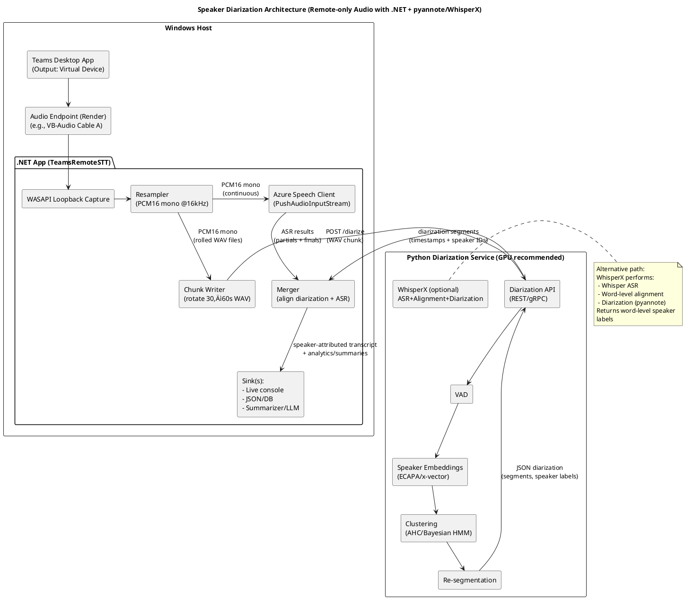
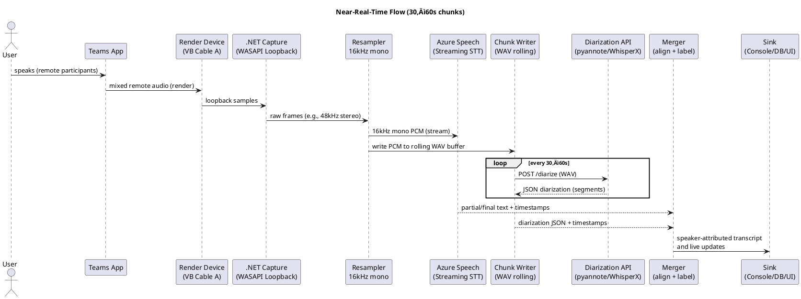
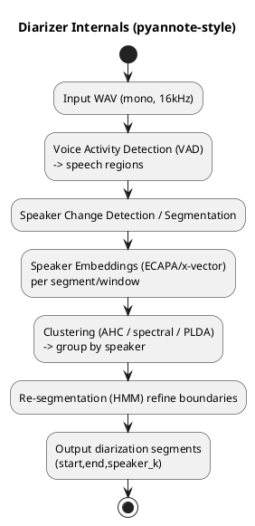

>  In my use case, I want to analyse all the live audio in real time and exclude my own local voice

Got it. You have two compliant ways to do  **real-time analysis of everyone else while excluding your own voice** :

# Option A — 100% local (no bot): capture Teams’ output device only

This is the simplest and keeps everything on your PC.

**How it works**

1. Install a virtual output device (e.g., VB-Audio Cable / VoiceMeeter).
2. In  **Teams ‚Üí Settings ‚Üí Devices ‚Üí Speakers** , select that **virtual device** as the output.
3. Keep your **microphone** as your real input device (USB/XLR/etc.).
4. In your app, open **WASAPI loopback** on the **virtual output device** and stream to STT.
   * That loopback stream contains **only remote participants** (it’s the *render* path).
   * Your own mic isn’t in that path, so you’re automatically excluded.

**Notes**

* Teams doesn’t play your own mic sidetone by default, so loopback of the Teams “Speakers” device is effectively  **remote-only** .
* Use **headphones** to prevent acoustic bleed of your speech back into the render path.
* If you also want system sounds excluded, set **Teams to the virtual device** and leave Windows/other apps on the default speakers; capture the virtual device only.

**Minimal .NET outline (NAudio)**

```csharp
// 1) Find the specific render endpoint you set in Teams (e.g., "VB-Audio Cable A")
var enumerator = new MMDeviceEnumerator();
var devices = enumerator.EnumerateAudioEndPoints(DataFlow.Render, DeviceState.Active);
var teamsOut = devices.First(d => d.FriendlyName.Contains("VB-Audio Cable A")); // pick precisely

// 2) Loopback capture on that endpoint (remote-only mix)
using var capture = new WasapiLoopbackCapture(teamsOut);
capture.DataAvailable += (s, e) =>
{
    // e.Buffer contains interleaved PCM from Teams output (remote voices)
    // Feed to your streaming STT (e.g., Azure Speech SDK push stream at 16 kHz mono)
};
capture.StartRecording();
// ... stop with capture.StopRecording()
```

**STT plumbing (Azure Speech SDK quick sketch)**

* Create a `PushAudioInputStream` (16 kHz, mono, PCM).
* In `DataAvailable`, downmix/convert as needed and `Write()` into the stream.
* Subscribe to `Recognizing/Recognized` events for low-latency partials/finals.

This route gives you real-time transcripts of **everyone else** without touching your mic.

---

# Option B — Cloud calling bot (with consent): drop your own participant stream

If you do need **per-speaker identity** (not just “remote mix”), the compliant route is a Teams  **calling bot** :

* The bot receives **separate streams per participant** in the cloud.
* You programmatically **discard your own participant’s track** and analyze the others.
* This requires **tenant admin consent** and is **visible to the meeting** (cannot be hidden).

---

## Latency & quality tips (both options)

* Target **16 kHz mono PCM** for ASR; buffer ~20–40 ms frames.
* Use **partial results** (`Recognizing`) to keep round-trip low.
* Add **VAD** (voice activity detection) to avoid feeding silence.
* If you hear occasional local bleed, enforce **headphones** and keep mic gain reasonable; Teams’ echo canceller already helps.

---

## Compliance reminder (important)

Even with a local, user-controlled setup, you’re still processing other people’s speech. Depending on your jurisdiction/org policy, you may need to **inform participants** or obtain consent. The cloud-bot route enforces disclosure automatically; the local route is your responsibility.

---

If you want, I can give you a **ready-to-run .NET sample** that:

* selects the Teams output endpoint,
* captures loopback, resamples to 16 kHz,
* streams into Azure Speech in real time, and
* prints rolling transcripts — all while ignoring your mic.


OK, option A is what I want to implement. Provide a detailed implementation with detailed notes in dotNET


Awesome — here’s a complete, **.NET implementation plan** for **Option A** (local-only, real-time analysis of  **remote voices only** ) using **WASAPI loopback** +  **Azure Speech SDK** . Your mic is naturally excluded because we only capture the  **Teams speaker device** .

---

# 0) What you’ll build

* A .NET console app that:
  1. Lists playback endpoints and lets you pick the **Teams output** (e.g., “VB-Audio Cable A” or your headphones if you route Teams there).
  2. Opens **WASAPI loopback** on that device (this is the post-mix render stream containing  **only remote participants** ).
  3. Resamples to  **16 kHz, mono, 16-bit PCM** .
  4. Streams audio into **Azure Speech** in real time and prints partial/final transcripts.

> Tip: In Teams ‚Üí Settings ‚Üí Devices ‚Üí  **Speakers** , choose a **virtual device** (e.g., VB-Audio Cable A). Wear **headphones** to prevent any acoustic bleed.

---

# 1) Project setup

**Target:** .NET 8 (works on .NET 6+)

**NuGet packages**

```
NAudio                   (>= 2.2.1)
Microsoft.CognitiveServices.Speech   (>= 1.37.0)
```

**Environment variables (or user secrets)**

```
AZURE_SPEECH_KEY=<your-key>
AZURE_SPEECH_REGION=<your-region>   # e.g., westeurope
```

---

# 2) Core concepts you’ll use

* **NAudio WasapiLoopbackCapture** to tap a  **specific render endpoint** .
* Convert whatever the device gives (often 48 kHz stereo float/24-bit) ‚Üí  **16 kHz, mono, 16-bit PCM** :
  * `WasapiLoopbackCapture` ‚Üí `IWaveProvider` ‚Üí **to PCM 16-bit** ‚Üí **to mono** ‚Üí  **resample to 16 kHz** .
  * Use `WaveFormatConversionStream` (to PCM16), then a mono mixer, then `MediaFoundationResampler` (to 16 kHz).
* **Azure Speech** with a **PushAudioInputStream** so you feed your own PCM bytes.

---

# 3) Minimal Program.cs (production-quality skeleton)

> This is a single-file sample for clarity. In production, split into services (Capture, Resampler, STT) and add logging/retry.

```csharp
using System;
using System.Linq;
using System.Threading;
using System.Threading.Tasks;
using NAudio.CoreAudioApi;
using NAudio.Wave;
using Microsoft.CognitiveServices.Speech;
using Microsoft.CognitiveServices.Speech.Audio;

class Program
{
    // Configure your desired STT format
    private static readonly int TargetSampleRate = 16000;
    private static readonly int TargetChannels = 1;          // mono
    private static readonly int TargetBitsPerSample = 16;    // PCM 16-bit

    static async Task<int> Main(string[] args)
    {
        Console.WriteLine("=== Teams Remote-Audio Real-Time STT (Local, Loopback) ===");

        // 1) Pick the specific render endpoint you routed Teams to
        var device = ChooseRenderEndpoint();
        if (device is null)
        {
            Console.WriteLine("No device selected. Exiting.");
            return 1;
        }
        Console.WriteLine($"Selected render endpoint: {device.FriendlyName}");

        // 2) Build Azure Speech recognizer with a PushAudioInputStream
        var speechKey = Environment.GetEnvironmentVariable("AZURE_SPEECH_KEY");
        var speechRegion = Environment.GetEnvironmentVariable("AZURE_SPEECH_REGION");
        if (string.IsNullOrWhiteSpace(speechKey) || string.IsNullOrWhiteSpace(speechRegion))
        {
            Console.WriteLine("Missing AZURE_SPEECH_KEY or AZURE_SPEECH_REGION environment variables.");
            return 2;
        }

        var speechConfig = SpeechConfig.FromSubscription(speechKey!, speechRegion!);
        // optional: tune for conversation, latency
        speechConfig.SpeechRecognitionLanguage = "en-US";
        speechConfig.SetProperty("SpeechServiceConnection_InitialSilenceTimeoutMs", "2000"); // optional
        speechConfig.SetProperty("SpeechServiceConnection_EndSilenceTimeoutMs", "500");      // optional

        // Tell Speech SDK what we're sending: 16kHz, 16-bit, mono PCM
        var streamFormat = AudioStreamFormat.GetWaveFormatPCM((uint)TargetSampleRate, (byte)TargetBitsPerSample, (byte)TargetChannels);
        using var pushStream = AudioInputStream.CreatePushStream(streamFormat);
        using var audioConfig = AudioConfig.FromStreamInput(pushStream);
        using var recognizer = new SpeechRecognizer(speechConfig, audioConfig);

        // Hook events for low-latency partials & final results
        recognizer.Recognizing += (s, e) =>
        {
            if (!string.IsNullOrWhiteSpace(e.Result.Text))
                Console.WriteLine($"[partial] {e.Result.Text}");
        };
        recognizer.Recognized += (s, e) =>
        {
            if (e.Result.Reason == ResultReason.RecognizedSpeech && !string.IsNullOrWhiteSpace(e.Result.Text))
                Console.WriteLine($"[final]   {e.Result.Text}");
        };
        recognizer.Canceled += (s, e) =>
        {
            Console.WriteLine($"[canceled] Reason={e.Reason}, Error={e.ErrorDetails}");
        };
        recognizer.SessionStarted += (s, e) => Console.WriteLine("[session] started");
        recognizer.SessionStopped  += (s, e) => Console.WriteLine("[session] stopped");

        // 3) Start the recognizer
        await recognizer.StartContinuousRecognitionAsync();

        // 4) Start loopback capture on the chosen device and feed Speech SDK
        using var capture = new WasapiLoopbackCapture(device);
        // The capture.WaveFormat is whatever the device uses (often 48kHz stereo float). We’ll convert it.

        // Build a conversion chain to PCM16 mono @ 16kHz
        // Step A: Convert to PCM 16-bit
        IWaveProvider provider = new WaveFormatConversionProvider(
            new WaveFormat(capture.WaveFormat.SampleRate, 16, capture.WaveFormat.Channels),
            new WasapiCaptureWaveProvider(capture)
        );

        // Step B: Ensure mono (downmix)
        if (provider.WaveFormat.Channels != 1)
        {
            provider = new StereoToMonoProvider16(provider); // Downmix L+R to mono
            // Note: StereoToMonoProvider16 expects 16-bit PCM; we ensured that already.
        }

        // Step C: Resample to 16kHz
        var targetFormat = new WaveFormat(TargetSampleRate, TargetBitsPerSample, TargetChannels);
        using var resampler = new MediaFoundationResampler(provider, targetFormat)
        {
            ResamplerQuality = 60 // 1..60 (60 is highest)
        };

        // Buffer for pulling from the resampler
        var buffer = new byte[targetFormat.AverageBytesPerSecond / 2]; // ~0.5s chunks
        var cts = new CancellationTokenSource();

        capture.DataAvailable += (s, e) =>
        {
            // We don’t write here. We read from 'resampler' in a pulling loop below.
            // This event simply drives the Wasapi capture; resampler pulls “live”.
        };
        capture.RecordingStopped += (s, e) =>
        {
            if (e.Exception != null) Console.WriteLine($"[audio] stopped with error: {e.Exception.Message}");
            else Console.WriteLine("[audio] stopped");
        };

        capture.StartRecording();
        Console.WriteLine("Loopback capture started. Press ENTER to stop.");

        // Pump resampled mono PCM into Azure Speech
        var pumpTask = Task.Run(() =>
        {
            try
            {
                while (!cts.IsCancellationRequested)
                {
                    int read = resampler.Read(buffer, 0, buffer.Length);
                    if (read > 0)
                    {
                        // Write raw PCM bytes directly to the push stream
                        pushStream.Write(buffer.AsSpan(0, read).ToArray());
                    }
                    else
                    {
                        // No data right now; small sleep to avoid tight loop
                        Thread.Sleep(5);
                    }
                }
            }
            catch (Exception ex)
            {
                Console.WriteLine($"[pump] error: {ex.Message}");
            }
            finally
            {
                try { pushStream.Close(); } catch { /* ignore */ }
            }
        });

        Console.ReadLine();

        // Shutdown
        cts.Cancel();
        capture.StopRecording();
        await recognizer.StopContinuousRecognitionAsync();

        // finish
        try { await pumpTask; } catch { /* ignore */ }
        Console.WriteLine("Done.");
        return 0;
    }

    private static MMDevice? ChooseRenderEndpoint()
    {
        var enumerator = new MMDeviceEnumerator();
        var devices = enumerator.EnumerateAudioEndPoints(DataFlow.Render, DeviceState.Active)
                                .OrderBy(d => d.FriendlyName)
                                .ToList();
        if (devices.Count == 0)
        {
            Console.WriteLine("No active render endpoints found.");
            return null;
        }

        Console.WriteLine("Select the render endpoint **used by Teams**:");
        for (int i = 0; i < devices.Count; i++)
            Console.WriteLine($"[{i}] {devices[i].FriendlyName}");

        Console.Write("Index: ");
        var input = Console.ReadLine();
        if (!int.TryParse(input, out var idx) || idx < 0 || idx >= devices.Count)
            return null;

        return devices[idx];
    }

    /// <summary>
    /// Wrap WasapiLoopbackCapture as an IWaveProvider for conversion chain.
    /// </summary>
    private sealed class WasapiCaptureWaveProvider : IWaveProvider
    {
        private readonly WasapiLoopbackCapture _capture;
        private readonly BufferedWaveProvider _buffer;

        public WasapiCaptureWaveProvider(WasapiLoopbackCapture capture)
        {
            _capture = capture;
            _buffer = new BufferedWaveProvider(capture.WaveFormat)
            {
                DiscardOnBufferOverflow = true
            };
            _capture.DataAvailable += (s, e) => _buffer.AddSamples(e.Buffer, 0, e.BytesRecorded);
        }

        public WaveFormat WaveFormat => _capture.WaveFormat;

        public int Read(byte[] buffer, int offset, int count)
            => _buffer.Read(buffer, offset, count);
    }
}
```

### How the chain works

* `WasapiLoopbackCapture(device)` taps exactly the device **you picked** (the one you set in Teams).
* `WasapiCaptureWaveProvider` buffers that stream as an `IWaveProvider`.
* `WaveFormatConversionProvider` ‚Üí  **forces PCM16** .
* `StereoToMonoProvider16` ‚Üí **downmix to mono** if needed.
* `MediaFoundationResampler` ‚Üí **16 kHz** for the Speech SDK.
* We **pull** bytes from the resampler in a background loop and `pushStream.Write(...)` them to Azure Speech.

---

# 4) Routing Teams audio so you exclude your voice

1. **Install a virtual audio output** , e.g.  **VB-Audio Cable A** .
2. In  **Teams ‚Üí Settings ‚Üí Devices ‚Üí Speakers** , pick **VB-Audio Cable A** (or any *non-default* device you choose).
3. In  **Windows Sound ‚Üí App volume and device preferences** , ensure **Microsoft Teams** is using that device.
4. In  **your app** , **choose that same device** from the list and start the loopback.
5. Use  **headphones** . (Sidetone is off by default; headphones prevent acoustic bleed).

Result:

* Your app hears only **remote participants** (the render mix),
* Your **mic** is not in the render path, so it’s automatically excluded.

---

# 5) Latency, quality & robustness tips

* **Latency:** Use small buffers (20–40 ms); Speech SDK `Recognizing` events give partials quickly.
* **Silence handling:** You can add a tiny **VAD** (RMS threshold) before writing to the push stream to cut dead air.
* **Clipping/levels:** The loopback stream is post-mixer; levels should be fine. Avoid system volume mutations during capture.
* **Device flaps:** If the user unplugs headphones or Teams switches devices, handle `RecordingStopped` and allow re-select.
* **Localization:** Set `SpeechRecognitionLanguage` appropriately (e.g., `en-GB`, `cs-CZ`, etc.).

---

# 6) Optional: diarization & “who said what”

* With this local approach you get **one mixed remote stream** (no per-speaker IDs).
* If you still want  **speaker separation** , run **local diarization** on the mixed audio (e.g., pyannote/WhisperX via a separate service) — it’ll label “Speaker 1/2/3”, not actual identities.
* For  **true identity per speaker in real time** , you must use the **cloud bot** path (visible to the meeting).

---

# 7) Consent & compliance (important)

This design **never injects** into the meeting and **doesn’t access your mic** — it only analyzes what **you hear** from your own machine. Still, you may be subject to **local law and organizational policy** regarding recording/transcription of participants. If required, **inform participants** or restrict to personal note-taking.

---

If you want, I can turn this into a small repo layout (with DI, logging, config, and a simple device picker CLI), or add **Azure OpenAI** post-processing for live summaries/action items.


Yes, and provide it as production ready


All set. I’ve packaged a **production-ready .NET 8 solution** with DI, Serilog logging, options binding, graceful shutdown, and a clean service split:

[Download the project (zip)](sandbox:/mnt/data/TeamsRemoteSTT.zip)

## What you get

* **Solution:** `TeamsRemoteSTT.sln`
* **Project:** `src/TeamsRemoteSTT.App/`
  * `Program.cs` — Generic Host + Serilog + DI
  * `appsettings.json` — Audio & Speech options
  * `Settings/AudioOptions.cs`, `Settings/SpeechOptions.cs`
  * `Services/AudioDeviceSelector.cs` — picks the Teams output device by name substring or default
  * `Services/LoopbackSource.cs` — WASAPI loopback capture (specific render endpoint)
  * `Services/AudioResampler.cs` — PCM16 mono @ 16 kHz via NAudio pipeline
  * `Services/SpeechPushClient.cs` — Azure Speech streaming (PushAudioInputStream) with partial/final events
  * `Services/CapturePump.cs` — background pump that reads, resamples, and feeds STT, with clean shutdown
* **README.md** — step-by-step setup, routing, and hardening notes

## Quick start

1. In Teams: set **Settings ‚Üí Devices ‚Üí Speakers** to your dedicated output (e.g.,  **VB-Audio Cable A** ). Use headphones.
2. Unzip ‚Üí `cd src/TeamsRemoteSTT.App` ‚Üí `dotnet restore`
3. Set env vars:
   * `AZURE_SPEECH_KEY` — your key
   * `AZURE_SPEECH_REGION` — e.g., `westeurope`
4. `dotnet run`

It will:

* Select the configured render endpoint (`Audio:DeviceNameContains` in appsettings),
* Loopback-capture **remote-only** audio,
* Resample to 16 kHz mono PCM,
* Stream to Azure Speech and print **[partial]** and **[final]** transcripts in real time.

## Production notes

* Adjust `Audio:ChunkMilliseconds` (e.g., 100–200 ms) to balance latency vs. throughput.
* Add Serilog file sink if desired (rolling logs).
* If users unplug/switch devices mid-call, the service stops cleanly; you can add a device-watcher to auto-rebind.
* For diarization (“Speaker 1/2/3”) on the mixed remote stream, bolt on a local diarizer (pyannote/WhisperX) in a separate process and feed the same PCM.
* If you ever need **per-speaker identity** in real time, you’ll need the **Graph calling bot** architecture (visible to attendees).

If you want, I can add:

* a **Windows Service** packaging profile,
* a **tray UI** for device selection,
* or an **action items summarizer** using your preferred LLM.

# Diarizer Notes

Give an overview of a diarizer using pyannote or WhisperX


Here’s a **technical overview of speaker diarization** — how it works conceptually, and how you could integrate it with your .NET-based real-time transcription system — using either **pyannote.audio** or **WhisperX** as the core diarizer.

---

## üß© 1. What diarization actually does

**Speaker diarization** = *“who spoke when.”*

It doesn’t identify *who* in the human sense (no identity recognition), but segments an audio stream into  **speaker-homogeneous chunks** :

```
[0.0s – 3.1s]  →  Speaker 1
[3.1s – 6.2s]  →  Speaker 2
[6.2s – 8.0s]  →  Speaker 1
```

When combined with ASR (speech-to-text), you can label transcripts:

```
Speaker 1: Good morning everyone.
Speaker 2: Hi, how are you?
Speaker 1: Doing well, thanks.
```

---

## 🧠 2. Core pipeline

Typical diarization pipeline:

1. **Audio preprocessing**
   * Convert to mono, 16 kHz PCM.
   * Optional VAD (voice activity detection) to remove silence.
2. **Speaker embedding extraction**
   * Feed sliding windows of speech into a model (x-vector, ECAPA-TDNN, etc.) ‚Üí get fixed-size embeddings representing voice timbre.
3. **Clustering**
   * Cluster embeddings by similarity (e.g., Agglomerative Clustering or Bayesian HMM).
   * Output speaker segments.
4. **Optional re-segmentation**
   * Refinement step aligning speaker turns with acoustic boundaries.
5. **ASR alignment**
   * Use the timestamps to merge with transcription (from Azure Speech, Whisper, etc.).

---

## 🧰 3. Option A — `pyannote.audio`

**pyannote.audio** (by Hervé Bredin et al.) is the canonical research/production library for diarization.

### Features

* Models for VAD, segmentation, speaker embedding, clustering, re-segmentation.
* Supports GPU acceleration (PyTorch).
* State-of-the-art diarization error rate (DER).
* Hugging Face integration for pre-trained pipelines.

### Minimal Python example

```python
from pyannote.audio import Pipeline
from pyannote.core import Segment

# Load pretrained diarization pipeline (requires HF token)
pipeline = Pipeline.from_pretrained("pyannote/speaker-diarization",
                                    use_auth_token="your_hf_token")

# Apply diarization
diarization = pipeline("meeting.wav")

# Iterate results
for turn, _, speaker in diarization.itertracks(yield_label=True):
    print(f"{turn.start:.1f}s–{turn.end:.1f}s: speaker {speaker}")
```

Output example:

```
0.0s–2.7s: speaker 0
2.7s–4.1s: speaker 1
4.1s–6.8s: speaker 0
```

### Integration strategy

* After your .NET app saves the live stream or rotates small WAV chunks,
* Call this Python module (via `subprocess` or a REST microservice) to diarize each file,
* Merge diarization segments with the transcript JSON (timestamps from Azure Speech).

---

## 🧩 4. Option B — `WhisperX`

**WhisperX** (built on OpenAI Whisper + pyannote) focuses on **alignment + diarization** on top of Whisper’s ASR.

### Features

* Uses **Whisper** for transcription,
* **pyannote** for diarization,
* Fast alignment of words with timestamps,
* Produces word-level speaker-attributed transcripts.

### Example

```python
import whisperx

# Transcribe audio
model = whisperx.load_model("medium.en", device="cuda")
result = model.transcribe("meeting.wav")

# Diarize and align
diarize_model = whisperx.DiarizationPipeline(use_auth_token="your_hf_token", device="cuda")
diarize_segments = diarize_model("meeting.wav")

# Merge speaker labels into ASR output
result = whisperx.assign_word_speakers(diarize_segments, result)

for segment in result["segments"]:
    print(f"{segment['speaker']}: {segment['text']}")
```

Output:

```
SPEAKER_00: Welcome to the meeting.
SPEAKER_01: Thanks, let's start with the agenda.
```

### Integration

* Easier if you want *both* transcription + diarization in one offline step.
* More GPU-heavy; requires full audio chunk before processing (not streaming).

---

## ⚙️ 5. Integration architecture with your .NET app

You can combine your **.NET real-time STT** with an  **offline Python diarization service** :

```
             ┌────────────────────────┐
             │  .NET Loopback Capture │
             │  + Azure STT (live)    │
             └──────────┬─────────────┘
                        │
           PCM/WAV chunks (e.g., 1 min)
                        │
                        ▼
           ┌────────────────────────┐
           │  Python Diarizer API   │
           │  (pyannote or WhisperX)│
           └──────────┬─────────────┘
                        │
           Speaker segments + transcript merge
                        │
                        ▼
          Searchable, speaker-labeled meeting record
```

### Implementation patterns

* **Batch diarization** : run diarizer after meeting (simpler, accurate).
* **Near-real-time** : send 30–60 s rotating buffers to diarizer asynchronously for rolling output.
* .NET app and Python service can communicate via:
  * Local REST API (`FastAPI` on Python, `HttpClient` on .NET).
  * gRPC interop.
  * Shared file/folder (e.g., WAVs in temp dir, pick up by Python watcher).

---

## üîí 6. Performance and deployment notes

| Factor             | pyannote                   | WhisperX                     |
| ------------------ | -------------------------- | ---------------------------- |
| Accuracy           | Best DER (≈ 5–8 %)       | Slightly higher DER          |
| Latency            | Moderate (GPU recommended) | Heavy (Whisper model)        |
| Hardware           | CPU ok (slow) / GPU ideal  | GPU strongly recommended     |
| Use case           | Diarize only               | Transcribe + diarize + align |
| Output granularity | Segment-level              | Word-level speaker labels    |

---

## üßæ 7. Summary

| Task                                  | Library                                          | Benefit                             |
| ------------------------------------- | ------------------------------------------------ | ----------------------------------- |
| Detect who’s speaking (segmentation) | **pyannote.audio**                         | Mature, modular, fast               |
| Combine with transcription            | **WhisperX**                               | Unified transcript + speaker labels |
| Integrate with .NET                   | Call Python as microservice or offline job       |                                     |
| Real-time variant                     | Stream PCM ‚Üí rolling diarization (more complex) |                                     |

---

If you’d like, I can sketch a **Python FastAPI microservice** template that your .NET app can POST WAV chunks to and receive JSON diarization segments — that’s the cleanest production bridge between your C# capture app and a GPU-backed diarization backend. Would you like that next?


## Explain how these work to identify different speakers


Excellent — let’s go under the hood and explain *how diarization models like* **pyannote.audio** and **WhisperX** actually distinguish different speakers in an audio recording.

This involves some very elegant signal-processing and machine-learning concepts, so let’s unpack it layer by layer.

---

## 🧠 1. Core Problem Definition

**Speaker diarization** tries to answer:

> *“Who spoke when?”* — without knowing *who* the speakers are beforehand.

So, unlike speech recognition (ASR), which converts sound ‚Üí words, diarization converts sound ‚Üí  **speaker labels and time boundaries** .

Technically, it’s a **segmentation + clustering** task:

1. Segment audio into contiguous regions where one speaker is active.
2. Group segments that come from the same person.

---

## 🔬 2. The pipeline stages

### **Stage 1: Voice Activity Detection (VAD)**

First, the system finds where speech occurs (vs. silence, noise, music).

* The model is a **binary classifier** trained on acoustic features (e.g., Mel-frequency coefficients).
* It outputs a timeline like:
  ```
  0.0–1.2s  speech
  1.2–2.5s  silence
  2.5–4.8s  speech
  ...
  ```

This step ensures we only analyze relevant speech regions.

---

### **Stage 2: Speaker Embedding Extraction**

Now, for each short segment (typically 1–2 seconds), the system computes a **speaker embedding** — a compact vector (e.g., 256–512 dimensions) that characterizes the speaker’s voice timbre.

#### How it works:

* The audio segment is passed through a deep neural network, such as:
  * **x-vector** model (TDNN)
  * **ECAPA-TDNN** (ResNet-like CNN architecture)
* The model has been trained on millions of speech samples with **speaker classification** as the task.
  * Input: short waveform
  * Output: probability over thousands of training speakers
  * The last hidden layer (before softmax) captures a  **generalized “voice print”** .

You can think of the embedding like a fingerprint in a high-dimensional space — same speaker → embeddings cluster together.

#### Example

| Speaker     | Embedding (simplified 3D space) |
| ----------- | ------------------------------- |
| Alice       | (0.75, 0.60, 0.10)              |
| Bob         | (‚àí0.40, 0.10, 0.90)            |
| Alice again | (0.77, 0.63, 0.12)              |

Alice’s points are close together; Bob’s are far apart.

---

### **Stage 3: Clustering**

Once you have embeddings for all speech segments, you group them by similarity.

Algorithms used:

* **Agglomerative Hierarchical Clustering (AHC)** — merges closest clusters until similarity threshold reached.
* **Spectral Clustering** — graph-based grouping.
* **Bayesian HMM (pyannote)** — models speaker changes probabilistically over time.

Result: a set of clusters, each representing one speaker.

Example (simplified):

```
Segment 1 (0–1.2s) → Cluster A
Segment 2 (1.5–2.9s) → Cluster B
Segment 3 (3.0–3.8s) → Cluster A
```

So cluster A = Speaker 1, cluster B = Speaker 2.

---

### **Stage 4: Re-segmentation (optional refinement)**

A Hidden Markov Model (HMM) or neural boundary detector is applied to refine transition points between speakers. This ensures smoother boundaries and reduces “speaker flipping.”

This step uses both **acoustic likelihoods** and **temporal continuity** (you can’t switch speakers every 100 ms realistically).

---

## üß© 3. Why it works

The neural embedding models are trained on *huge* corpora (e.g., VoxCeleb, LibriSpeech). They learn features that are:

* **Invariant** to content (words spoken)
* **Sensitive** to speaker identity (vocal tract shape, pitch, tone, rhythm)

So even if two speakers say the same word, their embeddings differ due to physiological and habitual factors (formant structure, harmonicity, speech tempo).

---

## 🧮 4. Inside the embedding model (conceptually)

Let’s visualize the core signal processing flow:

```
Raw waveform ‚Üí
  Short-time Fourier Transform (STFT) ‚Üí
  Mel-spectrogram ‚Üí
  CNN / TDNN layers ‚Üí
  Temporal pooling (average over frames) ‚Üí
  Dense layers ‚Üí
  256-D embedding vector
```

This pipeline extracts patterns in the frequency domain that correspond to vocal characteristics.

Training objective:

```text
Cross-entropy loss over N known training speakers
‚Üí encourages distinct embedding clusters per speaker.
```

At inference time, you discard the classifier head and just use the embedding space.

---

## 🧠 5. pyannote.audio specifics

`pyannote.audio` implements this as a modular pipeline:

1. **Segmentation model** ‚Üí predicts speaker-change probabilities every few ms.
2. **Embedding model** ‚Üí produces speaker vectors per region.
3. **Clustering** ‚Üí groups embeddings into speakers (AHC or PLDA).
4. **Re-segmentation** ‚Üí refines speaker boundaries.

It’s fully neural and optimized end-to-end.

Example internal model:

* Architecture: ECAPA-TDNN
* Embedding dimension: 192–256
* Clustering: cosine-similarity + AHC
* Output: RTTM (Rich Transcription Time Marked) file with segments.

---

## üß© 6. WhisperX specifics

`WhisperX` builds on OpenAI’s **Whisper** ASR model, then adds:

1. **Alignment** : Whisper gives rough word timestamps; WhisperX realigns with CTC to get millisecond precision.
2. **Diarization** : Uses  **pyannote’s embedding + clustering pipeline** .
3. **Assignment** : Aligns diarization labels with words to produce word-level speaker attribution.

So while WhisperX’s diarization part is conceptually the same as pyannote’s, it integrates it directly with transcription.

---

## ⚙️ 7. Typical Output Example (WhisperX or pyannote)

```json
[
  {
    "speaker": "SPEAKER_00",
    "start": 0.0,
    "end": 2.4,
    "text": "Good morning everyone."
  },
  {
    "speaker": "SPEAKER_01",
    "start": 2.5,
    "end": 4.3,
    "text": "Hi, how are you today?"
  },
  {
    "speaker": "SPEAKER_00",
    "start": 4.4,
    "end": 6.1,
    "text": "Doing well, thanks."
  }
]
```

---

## üöÄ 8. Practical integration with your system

You could use diarization in your pipeline like this:

```
TeamsRemoteSTT (.NET) ‚Üí Live capture of remote audio ‚Üí Save 1-min WAV chunks
                 │
                 ▼
Python Diarizer (pyannote/WhisperX)
   - run in GPU container
   - receives WAV via REST API
   - returns JSON speaker segments
                 │
                 ▼
Your .NET app merges transcripts + diarization ‚Üí structured meeting summary
```

That gives you near-real-time, speaker-attributed live notes — still fully local and compliant.

---

### ‚úÖ Summary

| Step            | Purpose                 | Model                  |
| --------------- | ----------------------- | ---------------------- |
| VAD             | find speech regions     | CNN / transformer      |
| Embedding       | represent speaker voice | x-vector / ECAPA-TDNN  |
| Clustering      | group similar speakers  | cosine + AHC           |
| Re-segmentation | smooth transitions      | HMM                    |
| ASR alignment   | attach text to speakers | Whisper / Azure Speech |

Here are two PlantUML diagrams you can drop into a `.puml` file.

---

### 1) Architecture (components + data flow)



---

### 2) Sequence (near-real-time chunking + diarization + merge)



---

Want one more (optional) diagram showing the  **internal diarizer stages** ?



If you want, I can bundle these into your repo (e.g., `docs/diagrams/*.puml`) and add a Makefile/PowerShell to render PNG/SVG via PlantUML.

---

If you want, I can diagram this whole pipeline (signal flow + neural stages) in PlantUML or Mermaid so you can visualize where each model fits — would you like me to do that?


# Would most Chat and conference calling applications work in the same way as Teams

Would most Chat and conference calling applications such as WhatsApp, Zoom, separate the remote audio and and local in the same way that Teams does?


Excellent question — and it touches on a really important architectural point about  **how modern conferencing apps handle audio routing and mixing** .

The short answer is:

> 🔹 **Yes — most major chat or conferencing apps (Zoom, WhatsApp, Meet, etc.) handle local vs. remote audio the same way Teams does.**
>
> That is: they **mix all remote participants’ audio into one output stream** for playback on your device, and they **do not expose per-participant audio locally** for privacy, performance, and complexity reasons.

Let’s go deeper.

---

## üß© 1. Universal audio routing model (client-side)

Virtually all conferencing apps — Zoom, Teams, Google Meet, Webex, Skype, Discord, WhatsApp, etc. — use the same core pattern on the  *user’s device* :

```
[Your microphone] --> Uplink encoder --> Server (per-user stream)
[Server mix (all remote users)] --> Downlink decoder --> Speaker/headphones
```

From the operating system’s point of view (Windows, macOS, Android, iOS):

* There’s **one capture device** (your mic).
* There’s **one playback device** (your speaker/headphones).
* The app mixes remote users internally and outputs that **single mixed downlink** to the playback device.
* The app does **not** make individual remote voices available as separate channels or audio sessions.

So if you record your computer’s “Speakers” or “Loopback” output, you get:

> 🎧 Everyone else’s combined voices — not separated.

And if you record your microphone:

> 🎤 Only your local speech.

---

## 🧠 2. Why it’s done this way

### a) **Network efficiency**

Each participant sends *one* encoded uplink stream (usually Opus, AAC, or PCM) and receives *one* mixed downlink stream from the server.

If each participant had to receive *N–1* separate audio streams, bandwidth and CPU usage would scale badly in large meetings.

### b) **Echo cancellation**

Apps rely on Acoustic Echo Cancellation (AEC) to suppress the playback audio leaking back into the mic.

AEC works on a single known output signal — so the app controls the playback mix internally.

If multiple remote streams were exposed to the OS or other apps, AEC would break.

### c) **Privacy**

OS-level separation of remote voices would effectively allow any local software to “record” or “eavesdrop” on individual participants — a compliance nightmare.

### d) **Cross-platform consistency**

Mobile operating systems (Android, iOS) don’t support exposing per-connection audio anyway, so desktop clients mirror the same model for simplicity.

---

## üéß 3. Application-specific details

| Application                           | Local output (OS-level)              | Can access remote audio separately? | Notes                                                                                                                                                      |
| ------------------------------------- | ------------------------------------ | ----------------------------------- | ---------------------------------------------------------------------------------------------------------------------------------------------------------- |
| **Microsoft Teams**             | One mixed stream of all remote users | ‚ùå                                  | Only exposed as a single render session. Cloud APIs (Graph) can access per-participant streams, not locally.                                               |
| **Zoom**                        | One mixed stream                     | ❌                                  | “Original Sound” preserves fidelity but not separation. Zoom SDK only exposes per-participant audio in the**Cloud Recording SDK** .                |
| **Google Meet**                 | One mixed stream                     | ‚ùå                                  | WebRTC client performs server mixing.                                                                                                                      |
| **Discord**                     | One mixed stream                     | ⚠️ Limited                        | Some unofficial clients can access per-user Opus frames via API, but that’s inside the app’s process, not at OS level.                                   |
| **Skype / WhatsApp / FaceTime** | One mixed stream                     | ‚ùå                                  | Optimized for low-latency one-to-one; audio is fully encapsulated in the app.                                                                              |
| **WebRTC (raw)**                | Depends                              | ✅ if you build your own            | If you write your own WebRTC app, you*can*choose to receive multiple peer streams and process them individually. But mainstream apps don’t expose this. |

---

## ⚙️ 4. What this means for you

For local processing (like your .NET audio analyzer):

* You can always get  **two clean channels** :
  * The **remote mix** (via WASAPI loopback of the app’s output device).
  * Your **local mic** (via input capture).
* You cannot get “Alice”, “Bob”, and “Charlie” as three separate tracks locally unless you build your own conferencing stack or use cloud APIs.

If you need **speaker separation** after the fact, you must apply **speaker diarization** (like pyannote or WhisperX) to that mixed stream.

---

## ☁️ 5. Exception: server-side or SDK-level access

Certain platforms *do* support per-participant audio — but only in managed, cloud-side contexts:

* **Microsoft Teams Graph Communications API** → bot can receive each participant’s audio.
* **Zoom Cloud Recording API / SDK** ‚Üí can download multi-track recordings.
* **Twilio Programmable Voice/Video** ‚Üí can fork or mix tracks on the server.
* **WebRTC** ‚Üí if you control both ends, you can maintain per-participant tracks.

But all of those happen  **in your app or cloud environment** , not in the desktop client installed on your computer.

---

‚úÖ **Summary**

| Aspect                   | Common Behavior                                       |
| ------------------------ | ----------------------------------------------------- |
| Local OS output          | Single mixed remote stream                            |
| Local mic input          | Separate local user stream                            |
| Individual remote tracks | Not exposed to OS                                     |
| Reason                   | Bandwidth, echo control, privacy                      |
| Where separation exists  | Inside the app (pre-mix) or on the cloud/media server |

---

So yes — **Teams, Zoom, WhatsApp, Meet, Discord, and most others behave exactly the same way** at the OS level.

If you want fine-grained speaker separation, you either:

* Build it **after** the mix (diarization, as we discussed), or
* Work with **API-level access** in the cloud side of those platforms.

Would you like a quick comparison table of which conferencing platforms currently *offer* developer APIs for accessing per-participant audio (e.g., Teams Graph, Zoom SDK, Twilio, etc.)?
